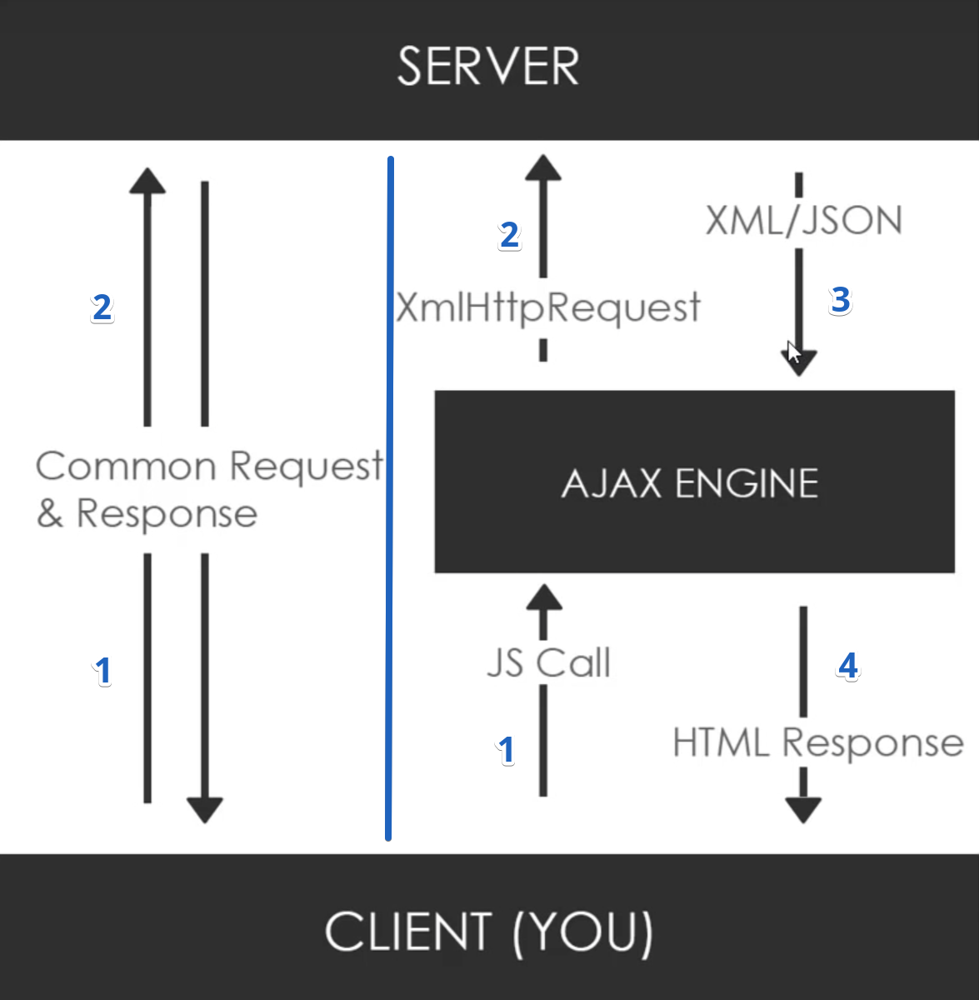
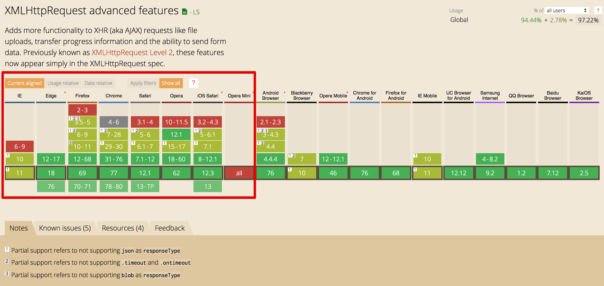

<p align="center">
 
</p>

<p align="center">
 
</p>

AJAX Asynchronous JavaScript and XML
=====================

Welcome
---------------------

About the Course/Tutorial
---------------------
Hi All, I'm **`Dinanath Jayaswal, Senior UI/Web Developer and Adobe Certified Expert Professional`**, I wanna welcome you to `AJAX (Asynchronous JavaScript and XML) Crash Course for Beginners`. This course/tutorial will give you a complete understanding of how to work with AJAX methodology/concepts to fetch/exchange (send and receive data) to-from web server.

This course will cover the basics of understanding JSON and AJAX using the practical implementation in your web development project. In this tutorial will explore how AJAX works and how it is used in web applications, will also see what `Fetch` and `XHR` are and how they work to get data.


Who is this for? 
---------------------
This course is for anyone interested in quickly learning AJAX+JSON & it's power to utilize it in Web Development. 

This Course/Tutorial is ideal for:
- Anyone who wants to learn AJAX from scratch
- Programmers and Developers at any level
- Web developers / Web Designers / Application developers / Software Developers
- Mobile Developers using the HTML5 Stack
- Anyone who wants to interchange data exchange between clients and servers
- Anyone who wants to create Dynamic Applications and use data seamlessly within web applications

This course/Tutorial is for anyone and everyone, Almost everyone!

Why learn AJAX
---------------------
`AJAX stands for Asynchronous JavaScript and XML`. JSON and AJAX together provide web developers with incredible opportunities to `integrate external data seamlessly (without page refresh/reload)` into web applications. AJAX helps to create and develop an amazing `interactive dynamic applications with better user experiences` that can synchronize data between your database and your front end HTML code (`minimizes the load on your server` and makes your `applications respond quickly and without reloading the HTML` page).


Course/Tutorial achievement
---------------------

Course/Tutorial Goal
---------------------
After completing/attending this AJAX Course/Tutorial, participants should be able to: 
- Understand what and why AJAX and JSON
- Use AJAX to fetch/exchange data in web projects
- Exchange Data with JSON format and use JSON in Web development/project

Prerequisites for current course / What you need to know
---------------------
- Basic knowledge and understandings of HTML, CSS, JavaScript, jQuery and ASP/PHP
- Knowledge of using any text editor and a web browser
- Basics of Browser and Internet
- A basic understanding of Client Side vs Server Side
- Working knowledge of JSON will be an added advantage

Before starting with AJAX it is advisable to view and go through the following course/tutorials to get knowledge of: 
- **Web Design Development Technology Fundamentals** - [Web Design Development Technology Fundamentals
](https://github.com/dinanathsj29/web-design-development-fundamentals-tutorial),
  - **HTML5** - [HTML5 Essentials Tutorial](https://github.com/dinanathsj29/html5-essentials-tutorial),
    - CSS3 - [CSS3 Fundamentals Tutorial](https://github.com/dinanathsj29/css3-fundamentals-tutorial),
      - **JavaScript** [JavaScript tutorial for Beginners](https://github.com/dinanathsj29/javascript-beginners-tutorial),
        - **JSON** [JSON JavaScript Object Notation crash course](https://github.com/dinanathsj29/json-javascript-object-notation-crash-course)

Topics included/covered
=====================

1. [Introduction to AJAX](#1-introduction-to-ajax)
  - 1.1. [What is AJAX?](#11-what-is-ajax)
  - 1.2. [Why use AJAX?](#12-why-use-ajax)
  - 1.3. [Synchronous vs Asynchronous](#13-synchronous-vs-asynchronous)
  - 1.4. [AJAX History](#14-ajax-history)
  - 1.5. [AJAX Technologies](#15-ajax-technologies)
  - 1.6. [How AJAX works?](#16-how-ajax-works)
  - 1.7. [AJAX Browser support](#17-ajax-browser-support)
  - 1.8. [Where AJAX is used? AJAX examples](#18-where-ajax-is-used-ajax-examples)
  - 1.9. [Drawbacks-Disadvantages of AJAX](#19-drawbacks-of-ajax)
 
2. [AJAX XMLHttpRequest](#2-ajax-xmlhttprequest)
  - 2.1. [What is XMLHttpRequest? (XHR)](#21-what-is-xmlhttprequest)
  - 2.2. [Libraries and other Methods](#22-libraries-and-other-methods)
  - 2.3. [XMLHttpRequest-loading JSON data](#23-xmlhttprequest-loading-json-data)
  - 2.4. [XMLHttpRequest-loading web API data](#24-xmlhttprequest-loading-web-api-data)
  - 2.5. [GET vs POST method](#25-get-vs-post-method)
  - 2.6. [XMLHttpRequest-onreadystatechange](#26-xmlhttprequest-onreadystatechange)

3. [AJAX Live Demo Example](#3-ajax-live-demo-example)
  - 3.1. [XMLHttpRequest-Get Post Data-Basic](#31-xmlhttprequest-get-post-data-basic)
  - 3.2. [XMLHttpRequest-Get Post Data-Advanced](#32-xmlhttprequest-get-post-data-advanced)

4. [JavaScript Http Request with fetch() API and Promises](#4-javascript-http-request-with-fetch()-api-and-promises)
  - 4.1. [Introduction to fetch() API](#41-introduction-to-fetch()-api)
  - 4.2. [fetch() API demo example](#42-fetch()-api-demo-example)

5. [JavaScript Http Request with Axios library](#5-javascript-http-request-with-axios-library) 

  - 5.1. [Introduction to fetch() API](#51-introduction-to-axios)
  - 5.2. [Axios demo example](#52-axios-demo-example)

6. [AJAX Reference and Resources](#6-ajax-reference-and-resources)

1 Introduction to AJAX
=====================

1.1. What is AJAX?
--------------------- 

- `AJAX (Asynchronous JavaScript and XML)`
- `AJAJ (Asynchronous JavaScript and JSON)`

The process of **`sending and receiving data on the fly without page refresh/reload`** is known as AJAX

- AJAX stands for Asynchronous JavaScript and XML enable web applications to retrieve data from the server asynchronously
- AJAX is *not a new programming language* - actually its a methodology or concepts or special way to bring JavaScript and XML (now a days JSON) together to produce impressive results
- **AJAX is set of web technologies** - just uses a combination of:
 - A browser built-in `XMLHttpRequest object` to request data from a web server
 - `JavaScript and HTML DOM` to display or use the data
 - It is a group of inter-related technologies like **`JavaScript, DOM, XML/JSON, HTML/XHTML, CSS, XMLHttpRequest`** etc.
- AJAX allows the web page to `"talk/communicate"` with the server behind the scene (send and receive data asynchronously)
- AJAX sends, receives and process information to or from the server without page refresh/reload (does not interfere with current web page/data) 
- Web application using AJAX enables partial page updates, ie. only the related section of the page is updated, without reloading the entire page
- AJAX minimize the page refreshes, so web sites/pages/web apps show more fluid/elegant-better experience to users
- AJAX and JSON together provide the ability to JavaScript code to make HTTP requests to get data and update page content with new data
- Now a days **`JSON`** has replaced `XML` for the most part and almost all dynamic websites use/implements AJAX concepts and methodology


1.2. Why use AJAX?
--------------------- 

- **`AJAX is pretty fast`** - as it allows you to send and receive data asynchronously without reloading the web page
- **`AJAX applications are non-blocking`** - as AJAX requests are asynchronous, we don't have to wait for the request processing to complete
- **`AJAX allows web pages to be updated asynchronously`** by exchanging data with a web server behind the scenes, this simply means that it is possible to update parts of a web page, without reloading the whole page
- **`Better performance and reduced network traffic`** - AJAX helps to send and receive only the required data so better performance
- **`No refresh-reload/No screen flicker`** - only a portion of the page is updated avoiding full page refresh/reload and screen flickering
- AJAX is used for building web-based interactive applications that process user requests immediately - **`no page reload`** to bring data into your application
- AJAX allows us to send and fetch only important/valuable part of data/information to/from the server, not the entire page so it **`makes your application interactive and faster`**
- XML is commonly used as the format for receiving server data, although **`any data exchange/interchange format can be used`** including JSON, plain text
- AJAX is a web browser technology **`independent of web server software/platform`**
- **`Data-driven`** as opposed to Page-driven methodology
- AJAX is the most viable, popular **`Rich Internet Application (RIA) technology`** so far with tremendous industry momentum and several tool kit and frameworks are emerging

1.3. Synchronous vs Asynchronous
---------------------
1.3. Understanding Synchronous vs Asynchronous
---------------------

### 1.3.1. Synchronous (Classic Web-Application Model)
A synchronous request **`blocks the client until the operation completes`** i.e. browser is unresponsive. In such a case, the JavaScript engine of the browser is blocked.

> **Example**:
 - **Mail application** - New email arrived - whole page refresh to show latest inbox and email
 - **Chat application** - On new message arrival complete chat application reloads
 - **Travel Website** - Destination place selected - request went to server -> got response -> page refresh to show fare details

### 1.3.2. Asynchronous (AJAX Web-Application Model)

An asynchronous request **`doesn’t block the client`** i.e. browser is responsive. At that time, the user can perform another operation also. In such a case, the JavaScript engine of the browser is not blocked.

> **Example**:
- While working with AJAX-based **Rich Internet Application (RIA)** we can work with a specific part of an application - send/receive data, so application is interactive and faster

| Synchronous execution | Asynchronous execution |
| ---------------------------------------------- | ---------------------------------------------- |
| When you execute something synchronously, you wait for it to finish before moving on to another task (QUEQE)| When you execute something asynchronously, you can move on to another task before it finishes (NO QUEQE) |
| Synchronous, or Synchronized means "connected", or "dependent" in some way | Asynchronous means they are totally independent and neither one must consider the other in any way, either in the initiation or in execution |
| Synchronize task are coordinated or combined with each other - one finishes than only another or next starts | Asynchronous task is not co-coordinated with other tasks (can execute in any order)|
| In the synchronous case, each statement completes before the next statement is run. In this case the program is evaluated exactly in order of the statements <br/>Be execute in order: 1 --> 2 --> 3 | In Asynchronous case, you don't stop execution, you can continue executing other code while the 'request' is being made <br/>1 or 2 or 3 anybody can execute and finish any time|
| **Example:** You are in a queue to get a **`food coupon or movie ticket`**. You cannot get one until the front of you gets one, and the same applies to the people queued behind you | **Example:** **`You are in a restaurant`** with many other people. You and Other people(everybody) can also order their food at the same time, no one has to wait for food to be cooked and served to you before they can order |
| **Example:** A `relay race` - <br/> `1st runner` runs till given distance, stops and passes the baton to the `2nd runner` and process continues till last runner | **Example:** `100 meters race or Marathon race` - any runner can run randomly and win | 


1.4. AJAX History
--------------------- 

1.4. History of AJAX
--------------------- 

| Year | Achievements |
| ---------------------------------------------- | ---------------------------------------------- |
| Mid 1990s &nbsp; &nbsp; &nbsp; &nbsp; &nbsp; &nbsp; &nbsp; &nbsp; &nbsp; &nbsp; &nbsp; &nbsp; &nbsp; &nbsp; &nbsp; &nbsp; &nbsp; &nbsp; &nbsp; &nbsp; &nbsp; &nbsp; &nbsp; &nbsp; &nbsp; &nbsp; &nbsp; &nbsp; &nbsp; &nbsp; | Most Web sites were based on static HTML pages, each user action/interaction required a complete new page be loaded from the serve |
| 1996 | **`iframe tag`** was introduced by **`Internet Explorer`**; like the object element, it can load or fetch content asynchronously |
| 1998 | **`Microsoft Outlook Web Access team`** developed the concept behind the **`XMLHttpRequest`** scripting object |
| 1999 | **`XMLHttpRequest (XMLHTTP)`** shipped with **`Internet Explorer 5.0`** |
| By year 2002 | The functionality of the XMLHTTP ActiveX control in IE 5 was later implemented by **`Mozilla, Safari, Opera, Internet Explorer 7`** and other browsers as the XMLHttpRequest JavaScript object |
| 2004 | **`Google Gmail`**. Google made a wide deployment of standards-compliant, cross browser Ajax with Gmail |
| 2004 | October 2004 **`Kayak.com's`** public beta release was among the first large-scale e-commerce |
| 2005 | **AJAX term coined in 2005 by Jesse James Garrett!** The term Ajax was publicly used on **`18 February 2005 by Jesse James Garrett`** in an article titled **`Ajax: A New Approach to Web Applications`**, based on techniques used on Google pages |
| 2005 | Google Maps |
| 2006 | On 5 April 2006, the **`World Wide Web Consortium (W3C)`** released the first draft specification for the XMLHttpRequest object |
| 2016 | On 6 October 2016, the latest draft of the XMLHttpRequest object was published |

- AJAX concepts are first implemented in the year 2004, a term coined publicly on **`18 February 2005 by Jesse James Garrett`** in an article titled **`Ajax: A New Approach to Web Applications`**


1.5. AJAX Technologies
--------------------- 

1.5. Technologies in AJAX
--------------------- 

The term **`AJAX`** has come to represent a broad group/set of Web Technologies that can be used to implement a Web application that/which communicates with a server in the background (behind the scenes), without interfering with the current state of the page. 

As describe earlier AJAX cannot work independently. AJAX is not a technology but group/set of inter-related technologies used in combination to create interactive webpages.

In the article titled **`Ajax: A New Approach to Web Applications`** by **`Jesse James Garrett`** that coined the term AJAX, explained that the following technologies are incorporated:

- HTML/XHTML and CSS *(for presentation)*
- The Document Object Model (DOM) *(for a dynamic display of and interaction with data)*
- XML or JSON *(for the interchange of data, and XSLT for its manipulation)*
- The XMLHttpRequest object *(for asynchronous communication)*
- JavaScript *(to bring these technologies together)*

### 1.5.1. HTML/XHTML and CSS
 - These technologies are used for displaying content (Text/Data - Text Layout Model) and style (Design/Presentation - Box Layout Model) 
 - It is mainly used for presentation layer

### 1.5.2. The Document Object Model (DOM)
 - API for accessing and manipulating structured documents
 - It is used for dynamic display and interaction with data
 - Represents the structure of XML and HTML documents
 
### 1.5.3. XML or JSON
 - Lightweight and popular data exchange/interchange format on the internet today!
 - For carrying data to and from server
 - JSON (Javascript Object Notation) is like XML but short, better, faster, lightweight, popular than XML

### 1.5.4. The XMLHttpRequest object
 - JavaScript object that performs asynchronous interaction with the server
 - For asynchronous communication between client and server
 - **`Sends data from the client in the background -> Receives the data from the server -> Updates the webpage without reloading it`**

### 1.5.5. JavaScript
 - It is used to bring above technologies together (Glue for the whole AJAX operation)
 - Loosely typed scripting language, it is used mainly for client-side logic/validation

1.6. How AJAX works?
--------------------- 

AJAX communicates with the web server using XMLHttpRequest object. Let's try to understand the flow and process of AJAX or how AJAX works (XMLHttp --> Request <-- Response mechanism) as displayed in the image below:

<p>
 <figure>
 &nbsp;&nbsp;&nbsp; 
 <figcaption>&nbsp;&nbsp;&nbsp; Image - AJAX - How AJAX works - flow diagram</figcaption>
 </figure>
</p>

<p>
 <figure>
 &nbsp;&nbsp;&nbsp; 
 <figcaption>&nbsp;&nbsp;&nbsp; Image - AJAX - How AJAX works - flow diagram</figcaption>
 </figure>
</p>

| Steps - Process | 
| ---------------------------------------------- | 
| 1. **`Client Side`** - An event occurs in a web page (a button is clicked) | 
| 2. An XMLHttpRequest object is created by JavaScript | 
| 3. The XMLHttpRequest object sends a request to a web server | 
| 4. **`Server Side`** - The server processes the XMLHttpRequest request |
| 5. The server sends a response back to the web page |
| 6. **`Client Side`** - The response is read by JavaScript |
| 7. Proper action/activity (like page update and showing the latest data) is performed by JavaScript |


1.7. AJAX Browser support
--------------------- 

All the available browser version cannot support AJAX. AJAX (XMLHttpRequest) is supported well in latest version of all popular browser:

<p>
 <figure>
 &nbsp;&nbsp;&nbsp; 
 <figcaption>&nbsp;&nbsp;&nbsp; Image - AJAX Browser support - September 2019</figcaption>
 </figure>
</p>

> **NOTE**:
Browser does not support AJAX, simply means that the `browser does not support the creation of Javascript object – XMLHttpRequest object`


1.8. Where AJAX is used? AJAX examples
--------------------- 

Many famous and widely used web applications use AJAX technology (to Save, Scroll, Autocomplete, AutoSave, etc.), like:
- Google Gmail, Google Search, Google Maps
- Facebook 
- Twitter
- Travel Sites
- Youtube
- Online Songs/Video players/websites
- Chat applications


1.9. Drawbacks of AJAX
--------------------- 

1.9. Disadvantages of AJAX
--------------------- 

- Any browser does not support JavaScript or XMLHttpRequest, or has this functionality disabled, will not be able to properly use AJAX-based/dependent pages
- Some Web applications that use AJAX are built in a way that cannot be read by screen-reading technologies, such as JAWS (In such a case the WAI-ARIA standards provide a way to provide hints)
- Screen readers may still not be able to properly read the dynamically generated content
- The asynchronous callback-style of programming required can lead to complex code that is hard to maintain, to debug and to test
- AJAX requests cannot be bookmarked easily


2 AJAX XMLHttpRequest
=====================

2.1. What is XMLHttpRequest?
--------------------- 
2.1. What is XMLHttpRequest? (XHR)
--------------------- 

- `XMLHttpRequest` method helps to establish a connection with a specific URL and send or receive data
- The `XMLHttpRequest` object is the key to AJAX, An object of `XMLHttpRequest` is used for asynchronous communication between client and server
- The `XMLHttpRequest` object can be used to exchange data with a web server asynchronously (behind the scenes), so it's possible to update parts of a web page, without reloading the whole page
- `XMLHttpRequest (XHR)` is an API in the form of an object whose methods transfer data between a web browser and a web server in the browser's JavaScript environment
- `XMLHttpRequest (XHR)` can be used with other protocols than HTTP
- `XMLHttpRequest (XHR)` works with data other than (JSON, plain text)

### XMLHttpRequest performs following operations:

- `Sends` data from the client in the background
- `Receives` the data from the server
- `Updates` the webpage without reloading it

> **XMLHttpRequest Syntax**:

```js 
XMLHttpRequest.open ('http method type', 'url-path');

XMLHttpRequest.open ('GET/POST', '.json file path or web API path');
```


2.2. Libraries and other Methods
--------------------- 

It's advisable to know plain vanilla JavaScript code to achieve AJAX with XMLHttpRequest.

There are a bunch of other libraries, methods, and ways to make AJAX calls. Third-party libraries are great, time-saving and make things easier (less code we can write to achieve things):

- jQuery (DOM manipulation library) - $ajax(), $load, $get, $post
- Angular - HttpClient
- Axios 
- Superagent
- Fetch API
- Prototype
- Node HTTP


2.3. XMLHttpRequest-loading JSON data
--------------------- 

> **Syntax & Example**: `2.3-loading-json-data/animals1.json`

```json
[
 {
 "name": "Meowsy1",
 "species": "cat",
 "foods": {
 "likes": [
 "tuna",
 "catnip"
 ],
 "dislikes": [
 "ham",
 "zucchini"
 ]
 }
 },
 {
 "name": "Barky1",
 "species": "dog",
 "foods": {
 "likes": [
 "bones",
 "carrots"
 ],
 "dislikes": [
 "tuna"
 ]
 }
 },
 {
 "name": "Purrpaws1",
 "species": "cat",
 "foods": {
 "likes": [
 "mice"
 ],
 "dislikes": [
 "cookies"
 ]
 }
 }
]
```

<hr/>

> **Syntax & Example**: `2.3-loading-json-data.html`

```html
<!DOCTYPE html>
<html lang="en">

 <head>
 <meta charset="UTF-8">
 <meta name="viewport" content="width=device-width, initial-scale=1.0">
 <meta http-equiv="X-UA-Compatible" content="ie=edge">
 <title>loading json data</title>
 
 <script type="text/javascript" src="2.3-loading-json-data.js"></script>

 </head>

 <body>
 
 </body>

</html>
```

<hr/>

> **Syntax & Example**: `2.3-loading-json-data.js`

```js
console.log('2.3-loading-json-data.js loaded');

var xhr = new XMLHttpRequest();
xhr.open('GET','animals1.json');

xhr.onload = function() {
 let results = xhr.responseText;
 console.log('string type of json:',results);
 document.write('<h1>Load JSON data from .json file:</h1>');
 document.write(results);

 results = JSON.parse(xhr.responseText);
 console.log('json object after parsing:',results);
 
 document.write('<h2>Load 0 th animal details:</h2>');
 var animal0 = results[0].name;
 document.write('Name : ' + animal0);
}

xhr.send();
```

> **Note**: *Its advisable to use local web-server like XAMP, MAMP or node/npm server utilities-packages like serve, http-server, static, local-web-server to avoid any - **CORS policy: Cross-origin requests errors***


2.4. XMLHttpRequest-loading web API data
--------------------- 

JSON Web API path: https://learnwebcode.github.io/json-example/animals-1.json

> **Syntax & Example**: `1.6.1-employee.json`

```html
<!DOCTYPE html>
<html lang="en">

 <head>
 <meta charset="UTF-8">
 <meta name="viewport" content="width=device-width, initial-scale=1.0">
 <meta http-equiv="X-UA-Compatible" content="ie=edge">
 <title>loading web API data</title>
 
 <script type="text/javascript" src="2.4-loading-json-web-api-data.js"></script>

 </head>

 <body>
 
 </body>

</html>
```

<hr/>

> **Syntax & Example**: `2.4-loading-json-web-api-data.js`

```js
console.log('2.4-loading-json-web-api-data.js loaded');

var xhr = new XMLHttpRequest();
xhr.open('GET','https://learnwebcode.github.io/json-example/animals-1.json');

xhr.onload = function() {
 let results = xhr.responseText;
 console.log('string type of json:',results);
 document.write('<h1>Load JSON data from .json file:</h1>');
 document.write(results);

 results = JSON.parse(xhr.responseText);
 console.log('json object after parsing:',results);
 
 document.write('<h2>Load 1 st animal details:</h2>');
 var animal1 = results[1].name;
 document.write('Name : ' + animal1);
}

xhr.send(); 
```


2.5. GET vs POST method
---------------------

| Points | GET method | POST method | 
| ------------------------------- | ------------------------------- | ------------------------------- |
| **`Send data visibility`** &nbsp; &nbsp; &nbsp; &nbsp; &nbsp; &nbsp; &nbsp; &nbsp; &nbsp; &nbsp; &nbsp; &nbsp; &nbsp; &nbsp; &nbsp; | GET sends data in open/visible mode in browser URL as a parameter | GET sends data in invisible/hidden (secure) mode |
| **`Encoding type`** | application/x-www-form-urlencoded | multipart/form-data or application/x-www-form-urlencoded Use multipart encoding for binary data |
| **`Secure`** | GET is better for non-secure data, like id/filter string parameters, query strings in Google, etc. | GET is better for secure/passing important-sensitive data, like Auth-Authorisation, password, keys, etc. |
| **`Data size`** | Sends data less than 2K of parameters, some servers handle up to 64K | Sending a large amount of data to the server (POST has no size limitations) | 
| **`Security`** | GET is less secure as compared to POST because data sent is part of the URL. So it's saved in browser history and server logs in plaintext | POST is a more safer than GET method because the parameters are not stored in browser history or web server logs | 
| **`Cached`** | Can be cached | Can not be cached |
| **`Usability`** | GET method can be used for sending data parameters (should not be used when sending passwords or other sensitive information) | POST method used when sending Auth-Authorisation, passwords or other sensitive information |
| **`Form data length restrictions`** | As data is in the URL and URL length is restricted, A safe URL length limit is often 2048 characters but varies by browser and web server | No data length and data size restrictions | 
| **`Form data type restrictions`** | Only ASCII characters allowed | No restrictions! Binary data is also allowed | 
| **`Hacked`** | Easier to hack for script kiddies, computer attackers or hackers | Difficult to hack |
| **`Bookmarked`** | Can be bookmarked | Can be bookmarked |
| **`Form method`** | GET is the default method in the form element | To use POST we need to specify it in HTML Forms as `method="POST"` |


2.6. XMLHttpRequest-onreadystatechange
---------------------

### 2.6.1. XMLHttpRequest-onreadystatechange property
- The XMLHttpRequest object has a special property called `onreadystatechange`
- `onreadystatechange` stores the function that will process the response from the server
- The `XMLHttpRequest.onreadystatechange` property stores a function, contains the event handler to be called when the `readystatechange` event is fired, that is every time the `readyState` property of the XMLHttpRequest changes

### 2.6.2. XMLHttpRequest-readystate property

- The `XMLHttpRequest` object has another property called `readyState`
- `readyState` is where the status of our server's response is stored 
- Each time the `readyState` changes then our `onreadystatechange` function executes, The response can be:
 - processing, 
 - downloading or 
 - completed

| Property | Description | 
| ------------------------------- | ------------------------------- |
| onreadystatechange | Defines a function to be called when the readyState property changes |
| readyState | Holds/Stores the status of the XMLHttpRequest, readyState Status can be: <li>0: request not initialized</li> <li>1: server connection established</li> <li>2: request received</li> <li>3: processing request</li> <li>4: request finished and response is ready</li> | 
| status | The status property and the statusText property holds the status of the XMLHttpRequest object, Status can be: <li>200: "OK"</li> <li>403: "Forbidden"</li> <li>404: "Page not found"</li> |
| statusText | The status property and the statusText property holds the status of the XMLHttpRequest object, Returns the status-text (e.g. "OK" or "Not Found") |

> **Note**: When the property `readyState is 4` that means the response is complete and we can get our data

### 2.6.3. XMLHttpRequest-responsetext property

- We can retrieve the server's response by using the `responseText` property
- Using a little bit of Javascript and HTML forms we can change our text box or results equal responseText


> **Syntax & Example**: `2.6-onreadystatechange.html`

```html
<!DOCTYPE html>
<html lang="en">

 <head>
 <meta charset="UTF-8">
 <meta name="viewport" content="width=device-width, initial-scale=1.0">
 <meta http-equiv="X-UA-Compatible" content="ie=edge">
 <title>onreadystatechange</title>
 
 <script type="text/javascript" src="2.6-onreadystatechange.js"></script>

 </head>

 <body>

 <h1>The XMLHttpRequest Object - onreadystatechange</h1>

 <button type="button" onclick="loadData()">Load Content</button>
 
 <div id="textContainer"></div>

 </body>

</html>
```

<hr/>

> **Syntax & Example**: `2.6-onreadystatechange.js`

```js
console.log('2.6-onreadystatechange.js loaded');

function loadData() {

 var xhr = new XMLHttpRequest();
 xhr.open('GET','data.txt',true);

 xhr.onreadystatechange = function() {
 if(this.readyState == 4 && this.status == 200) {
 // responseText and response both are same/similar
 let responseText = xhr.responseText;
 let response = xhr.response;
 console.log('responseText',responseText);
 console.log('response',response);

 // document.getElementById("textContainer").innerHTML = this.responseText;
 document.getElementById("textContainer").innerText = this.responseText;

 }
 }

 xhr.send();

}

```

<hr/>

> **Syntax & Example**: `data.txt`

```
<h3>### 2.6.1. XMLHttpRequest-onreadystatechange property</h3>

<li>The XMLHttpRequest object has a special property called `onreadystatechange`</li>

<li>`onreadystatechange` stores the function that will process the response from the server</li>

<li>The `XMLHttpRequest.onreadystatechange` property stores a function, contains the event handler to be called when the `readystatechange` event is fired, that is every time the `readyState` property of the XMLHttpRequest changes</li>
```


3 AJAX Live Demo Example
=====================

3.1. XMLHttpRequest-Get Post Data-Basic
---------------------

> **Syntax & Example**: `3.1-xhr-req-res-live.html`

```html
<!DOCTYPE html>
<html lang="en">

  <head>
    <meta charset="UTF-8">
    <meta name="viewport" content="width=device-width, initial-scale=1.0">
    <meta http-equiv="X-UA-Compatible" content="ie=edge">
    <title>3.1-xhr-req-res-live.html</title>
    
    <link type="text/css" rel="stylesheet" href="styles.css">
    <!-- Without async or defer , browser will run your script immediately, before rendering the elements that's below your script tag. -->
    <script type="text/javascript" src="3.1-xhr-req-res-live.js" defer></script>

  </head>

  <body>

    <section class="button-container">
      <button id="getButton" class="button">GET DATA</button>
      <button id="postButton" class="button">POST LOGIN DATA</button>
    </section>
   
  </body>

</html>
```

<hr/>

> **Syntax & Example**: `3.1-xhr-req-res-live.js`

```js
console.log('3.1-xhr-req-res-live.js loaded');

// get buttons from html/DOM
const getButton = document.getElementById('getButton');
const postButton = document.getElementById('postButton');

// define function to get data
fn_getData = () => {
  console.log('getButton clicked - in fn_getData');

  var xhr = new XMLHttpRequest();
  // use fake rest api `https://reqres.in/`, below url get list of users
  xhr.open('GET', 'https://reqres.in/api/users');

  // convert XMLHttpRequest results to 'json' bydefault
  xhr.responseType = 'json';

  xhr.onload = () => {
    let results = xhr.response;
    console.log('results:', results);

    //convert string data to json/javascript object - ommit by using xhe.responseType = 'json'
    // const jsonData = JSON.parse(results);
    // console.log('jsonData:', jsonData);
  }

  xhr.send();
}

// define function to post/send data
fn_postData = () => {
  console.log('postButton clicked - in fn_postData');

  const postData = {
    "email": "eve.holt@reqres.in",
    "password": "pistol"
  };

  var xhr = new XMLHttpRequest();
  // use fake rest api `https://reqres.in/`, below url get list of users
  xhr.open('POST', 'https://reqres.in/api/register');

  // convert XMLHttpRequest results to 'json' bydefault
  // xhr.responseType = 'json';
  xhr.setRequestHeader("Content-Type", "application/json; charset=UTF-8");

  xhr.onload = function () {
    var results = JSON.parse(xhr.responseText);
    console.log(results);

  };

  xhr.send((JSON.stringify(postData)));
}

// add event listener to button
getButton.addEventListener('click', fn_getData);
postButton.addEventListener('click', fn_postData);
```


3.2. XMLHttpRequest-Get Post Data-Advanced
---------------------

> **Syntax & Example**: `3.2-xhr-req-res-live-advanced.html`

```html
<!DOCTYPE html>
<html lang="en">

  <head>
    <meta charset="UTF-8">
    <meta name="viewport" content="width=device-width, initial-scale=1.0">
    <meta http-equiv="X-UA-Compatible" content="ie=edge">
    <title>3.2-xhr-req-res-live-advanced.html</title>
    
    <link type="text/css" rel="stylesheet" href="styles.css">
    <!-- Without async or defer , browser will run your script immediately, before rendering the elements that's below your script tag. -->
    <script type="text/javascript" src="3.2-xhr-req-res-live-advanced.js" defer></script>

  </head>

  <body>

    <section class="button-container">
      <button id="getButton" class="button">GET DATA</button>
      <button id="postButton" class="button">POST LOGIN DATA</button>
    </section>

    <section class="user-container">
      <h1 class="user-name"></h1>
      <span class="user-email"></span> <br/> <br/>
      
    </section>
   
  </body>

</html>
```

<hr/>

> **Syntax & Example**: `3.2-xhr-req-res-live-advanced.js`

```js
console.log('3.2-xhr-req-res-live-advanced.js loaded');

// get buttons from html/DOM
const getButton = document.getElementById('getButton');
const postButton = document.getElementById('postButton');

// common function to send receive http call
const fn_sendhttpRequest = (httpMethod, httpUrl, data) => {
  // promise
  const httpPromise = new Promise((resolve, reject) => {

    const xhr = new XMLHttpRequest();

    // use fake rest api `https://reqres.in/`, below url get list of users
    xhr.open(httpMethod, httpUrl);

    // convert XMLHttpRequest results to 'json' bydefault
    xhr.responseType = 'json';

    if (data) {
      xhr.setRequestHeader("Content-Type", "application/json; charset=UTF-8");
    }

    xhr.onload = () => {
      if (xhr.status >= 400) {
        reject(xhr.response);
      } else {
        resolve(xhr.response);
      }
    }

    xhr.onerror = () => {
      reject('Please verify...something went wrong!');
    }

    xhr.send(JSON.stringify(data));

  });

  return httpPromise;

}

// define function to get data
const fn_getData = () => {
  console.log('getButton clicked - in fn_getData');

  fn_sendhttpRequest('GET', 'https://reqres.in/api/users').then(respenseResultData => {
    console.log('respenseResultData:', respenseResultData);
    document.getElementsByClassName('user-name')[0].innerHTML = respenseResultData.data[0].first_name + ' ' + respenseResultData.data[0].last_name;
    document.getElementsByClassName('user-email')[0].innerHTML = respenseResultData.data[0].email;
    document.getElementsByClassName('user-image')[0].src = respenseResultData.data[0].avatar;
  });

}

// define function to post/send data
const fn_postData = () => {
  console.log('postButton clicked - in fn_postData');

  const postLoginData = {
    "email": "eve.holt@reqres.in",
    "password": "pistol"
  };

  fn_sendhttpRequest('POST', 'https://reqres.in/api/register', postLoginData).then(respenseResultData => {
    console.log('respenseResultData:', respenseResultData);
  }).catch(err => {
    console.log('errors: ', err);
  });

}

// add event listener to button
getButton.addEventListener('click', fn_getData);
postButton.addEventListener('click', fn_postData);
```


4 JavaScript Http Request with fetch() API and Promises
=====================

4.1. Introduction to fetch() API
---------------------
- Fetch is a new, modern, promise-based API that lets us do Ajax requests without all the unnecessary complications associated with XMLHttpRequest
- `fetch() API` is a modern replacement for XMLHttpRequest, addition to the browser, better than xmlHttpRequest 
- fetch API, which is a modern way to Ajax without helper libraries like jQuery or Axios
- The Fetch API provides a fetch() method defined on the window object, which you can use to perform requests. This method returns a Promise that you can use to retrieve the response of the request
- `fetch()` is the globally available method/function made available/provided by the browser for sending http-request
- Browser support: Support for Fetch is pretty good! All major browsers (exception of Opera Mini and old IE) support it natively, which means we can safely use it in our projects (older browser does not support!)


4.2. fetch() API demo example
---------------------

> **Syntax & Example**: `4.2-fetch-api.html`

```html
<!DOCTYPE html>
<html lang="en">

  <head>
    <meta charset="UTF-8">
    <meta name="viewport" content="width=device-width, initial-scale=1.0">
    <meta http-equiv="X-UA-Compatible" content="ie=edge">
    <title>4.2-fetch-api</title>
    
    <link type="text/css" rel="stylesheet" href="styles.css">
    <!-- Without async or defer , browser will run your script immediately, before rendering the elements that's below your script tag. -->
    <script type="text/javascript" src="4.2-fetch-api.js" defer></script>

  </head>

  <body>

    <section class="button-container">
      <button id="getButton" class="button">GET DATA</button>
      <button id="postButton" class="button">POST LOGIN DATA</button>
    </section>

    <section class="user-container">
      <h1 class="user-name"></h1>
      <span class="user-email"></span> <br/> <br/>
      
    </section>
   
  </body>

</html>
```

<hr/>

> **Syntax & Example**: `4.2-fetch-api.js`

```javascript
console.log('4.2-fetch-api.js loaded');

// get buttons from html/DOM
const getButton = document.getElementById('getButton');
const postButton = document.getElementById('postButton');

// define function to get data
const fn_getData = () => {
  console.log('getButton clicked - in fn_getData');

  fetch('https://reqres.in/api/users').then(respenseResult => {
    console.log('respenseResult:', respenseResult);
    // to convert response body: ReadableStream to json
    return respenseResult.json();
  })
  .then(respenseResultData => {
    console.log('respenseResultData:', respenseResultData);

    document.getElementsByClassName('user-name')[0].innerHTML = respenseResultData.data[0].first_name + ' ' + respenseResultData.data[0].last_name;
    document.getElementsByClassName('user-email')[0].innerHTML = respenseResultData.data[0].email;
    document.getElementsByClassName('user-image')[0].src = respenseResultData.data[0].avatar;
  });
}

// define function to post/send data
const fn_postData = () => {
  console.log('postButton clicked - in fn_postData');

  const options = {
    method: 'post',
    headers: {
      'Content-type': 'application/x-www-form-urlencoded; charset=UTF-8'
    },
    body: 'email=eve.holt@reqres.in&password=pistol'
  }
  
  fetch('https://reqres.in/api/register', options)
  .then(respenseResult => {
    console.log('respenseResult:', respenseResult);
    return respenseResult.json();
  })
  .then(respenseResultData => {
    console.log('respenseResultData:', respenseResultData);
  })
  .catch(err => {
    console.error('Request failed', err)
  })

}

// add event listener to button
getButton.addEventListener('click', fn_getData);
postButton.addEventListener('click', fn_postData);
```

<hr/>

> **Syntax & Example**: `4.2-fetch-api-advanced.html`

```html
<!DOCTYPE html>
<html lang="en">

  <head>
    <meta charset="UTF-8">
    <meta name="viewport" content="width=device-width, initial-scale=1.0">
    <meta http-equiv="X-UA-Compatible" content="ie=edge">
    <title>4.2-fetch-api-advanced</title>
    
    <link type="text/css" rel="stylesheet" href="styles.css">
    <!-- Without async or defer , browser will run your script immediately, before rendering the elements that's below your script tag. -->
    <script type="text/javascript" src="4.2-fetch-api-advanced.js" defer></script>

  </head>

  <body>

    <h1><center>4.2-fetch-api-advanced</center></h1>
    <section class="button-container">
      <button id="getButton" class="button">GET DATA</button>
      <button id="postButton" class="button">POST LOGIN DATA</button>
    </section>

    <section class="user-container">
      <h1 class="user-name"></h1>
      <span class="user-email"></span> <br/> <br/>
      
    </section>
   
  </body>

</html>
```

<hr/>

> **Syntax & Example**: `4.2-fetch-api-advanced.js`

```javascript
console.log('4.2-fetch-api-advanced.js loaded');

// get buttons from html/DOM
const getButton = document.getElementById('getButton');
const postButton = document.getElementById('postButton');

// common function to send receive http call
const fn_sendhttpRequest = (httpMethod, httpUrl, data) => {

  return fetch(httpUrl, {
    method: httpMethod,
    body: JSON.stringify(data),
    headers: data ? {'Content-type': 'application/json'} : {}
  }).then(respenseResult => { 
    console.log('respenseResult:', respenseResult);
    if (respenseResult.status >= 400) {
      return respenseResult.json().then(errResponseData => {
        const error = new Error('Please verify...something went wrong!');
        error.data = errResponseData;
        throw error;
      })
    }
    // to convert response body: ReadableStream to json
    return respenseResult.json();
  })

}

// define function to get data
const fn_getData = () => {
  console.log('getButton clicked - in fn_getData');

  fn_sendhttpRequest('GET', 'https://reqres.in/api/users')
  .then(respenseResultData => {
    console.log('respenseResultData:', respenseResultData);

    document.getElementsByClassName('user-name')[0].innerHTML = respenseResultData.data[0].first_name + ' ' + respenseResultData.data[0].last_name;
    document.getElementsByClassName('user-email')[0].innerHTML = respenseResultData.data[0].email;
    document.getElementsByClassName('user-image')[0].src = respenseResultData.data[0].avatar;
  });

}

// define function to post/send data
const fn_postData = () => {
  console.log('postButton clicked - in fn_postData');

  const postLoginData = {
    email: "eve.holt@reqres.in",
    password: "pistol"
  };

  fn_sendhttpRequest('POST', 'https://reqres.in/api/register', postLoginData)
  .then(respenseResultData => {
    console.log('respenseResultData:', respenseResultData);
  })
  .catch(err => {
    console.error('Request failed', err)
  })

}

// add event listener to button
getButton.addEventListener('click', fn_getData);
postButton.addEventListener('click', fn_postData);
```

5 JavaScript Http Request with Axios library
=====================

5.1. Introduction to Axios
---------------------

- Axios is an open-source library that allows us to easily make HTTP requests
- Axios is a third-party JavaScript library which wraps xmlHttpRequest, based on Promise API and makes working with AJAX much easier
- Axios is a Promise-based HTTP client for JavaScript which can be used in your front-end application, also in Node.js backend
- Browser support: It supports all modern browsers, including support for IE8 and higher! All major browsers support it, as xmlHttpRequest is the base of Axios


5.2. Axios demo example
---------------------

> **Syntax & Example**: `5.2-axios.html`

```html
<!DOCTYPE html>
<html lang="en">

  <head>
    <meta charset="UTF-8">
    <meta name="viewport" content="width=device-width, initial-scale=1.0">
    <meta http-equiv="X-UA-Compatible" content="ie=edge">
    <title>5.2-axios</title>
    
    <link type="text/css" rel="stylesheet" href="styles.css">
    <script type="text/javascript" src="axios.min.js" defer></script>
    <!-- Without async or defer , browser will run your script immediately, before rendering the elements that's below your script tag. -->
    <script type="text/javascript" src="5.2-axios.js" defer></script>

  </head>

  <body>

    <h1><center>5.2-axios</center></h1>
    <section class="button-container">
      <button id="getButton" class="button">GET DATA</button>
      <button id="postButton" class="button">POST LOGIN DATA</button>
    </section>

    <section class="user-container">
      <h1 class="user-name"></h1>
      <span class="user-email"></span> <br/> <br/>
      
    </section>
   
  </body>

</html>
```

<hr/>

> **Syntax & Example**: `5.2-axios.js`

```javascript
console.log('5.2-axios.js loaded');

// get buttons from html/DOM
const getButton = document.getElementById('getButton');
const postButton = document.getElementById('postButton');

// define function to get data
const fn_getData = () => {
  console.log('getButton clicked - in fn_getData');

  axios.get('https://reqres.in/api/users').then(respenseResultData => {
    console.log('respenseResultData:', respenseResultData);

    document.getElementsByClassName('user-name')[0].innerHTML = respenseResultData.data.data[0].first_name + ' ' + respenseResultData.data.data[0].last_name;
    document.getElementsByClassName('user-email')[0].innerHTML = respenseResultData.data.data[0].email;
    document.getElementsByClassName('user-image')[0].src = respenseResultData.data.data[0].avatar;
  })

}

// define function to post/send data
const fn_postData = () => {
  console.log('postButton clicked - in fn_postData');

  const postLoginData = {
    email: "eve.holt@reqres.in",
    password: "pistol"
  };

  axios.post('https://reqres.in/api/register', postLoginData, {
    headers: {
      'Content-type': 'application/json'
    }
  }).then(respenseResultData => {
    console.log('respenseResultData:', respenseResultData);
    console.log('respenseResultData.data:', respenseResultData.data);
  }).catch(err => {
    console.error('Request failed...Something went wrong :', err);
    console.error(err, err.response.data);
  })

}

// add event listener to button
getButton.addEventListener('click', fn_getData);
postButton.addEventListener('click', fn_postData);
```


6 AJAX Reference and Resources
=====================

> https://reqres.in/

> axios - https://github.com/axios/axios
